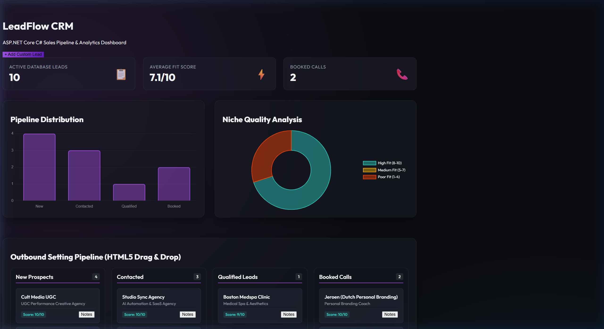
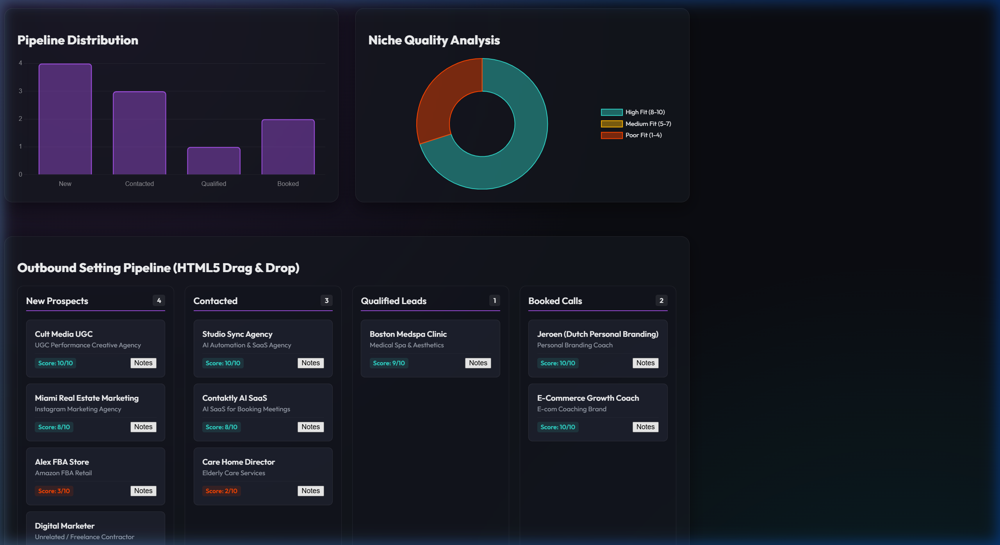
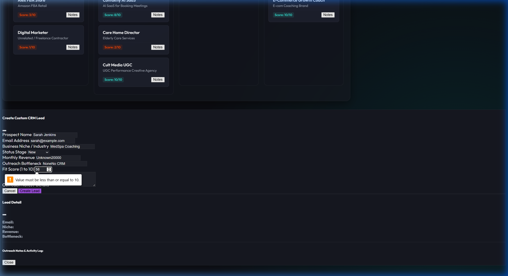

# 📊 LeadFlow — ASP.NET Core CRM Lead Dashboard

> **A custom-built, full-stack CRM pipeline dashboard** demonstrating production-grade C# development: drag-and-drop Kanban, real-time Chart.js analytics, Entity Framework Core, and SQLite persistence.

Built with **ASP.NET Core 9.0 MVC (C#)**, **Entity Framework Core**, and **Chart.js**. Runs out-of-the-box with zero external dependencies — just `dotnet run`.

---

## 📸 Screenshots

### Dashboard Overview — KPIs & Analytics


### Kanban Pipeline Board


### KPIs After Adding a New Lead


---

## 🚀 Core Features

| Feature | Description |
|---|---|
| 🗂️ **Drag-and-Drop Kanban** | HTML5 drag-and-drop pipeline board updating SQLite via fetch API in real-time |
| 📈 **Chart.js Analytics** | Bar charts for stage distribution + doughnut charts for fit-score quality analysis |
| 🗄️ **EF Core + SQLite** | Fully typed data model, automatic DB creation, and seeded demo leads on first run |
| 📋 **KPI Summary Cards** | Live totals for Total Leads, New This Week, Booked Calls, and Average Fit Score |
| ➕ **Lead Capture Form** | Modal form to add custom prospects with full field validation |
| 📝 **Notes Overlay** | Pop-up modal to read full prospect qualification notes per lead card |

---

## 🔄 Pipeline Flow

```
New Lead Generated (from DM, ads, or outreach)
        ↓
Added to Kanban Board → Status: "New"
        ↓
Appointment Setter qualifies lead → Status: "Contacted"
        ↓
Fit score assessed → Status: "Qualified" (score ≥ 6)
        ↓
Discovery call booked → Status: "Booked"
        ↓
Chart.js analytics update in real-time
```

---

## 📁 Repository Structure

```
aspnet_crm_dashboard/
├── Controllers/
│   └── DashboardController.cs   # Routes, API endpoints, and data queries
├── Data/
│   └── CrmDbContext.cs          # EF Core config + 10 seeded demo leads
├── Models/
│   └── Lead.cs                  # C# data model for the Leads table
├── Views/
│   └── Dashboard/
│       └── Index.cshtml         # Razor view: Kanban, Charts, KPIs, Forms
├── Program.cs                   # App startup, DI registration, DB migration
├── aspnet_crm_dashboard.csproj  # .NET 9 project config with NuGet references
├── crm_database.db              # Pre-seeded SQLite database (10 demo leads)
├── screenshot_dashboard.png
├── screenshot_kanban.png
└── screenshot_kpis.png
```

---

## 🛠️ Installation & Setup

### Prerequisites
- **.NET SDK 9.0** — [Download here](https://dotnet.microsoft.com/download)

```bash
dotnet --version   # Should output 9.x.x
```

### Quick Start

```bash
git clone https://github.com/manoj-vellingiri/aspnet-crm-dashboard.git
cd aspnet-crm-dashboard
dotnet restore
dotnet run
```

Open: **[http://localhost:5050](http://localhost:5050)**

> ✅ The SQLite database (`crm_database.db`) is pre-seeded with 10 demo leads across niches like medspas, coaching agencies, and care homes. No manual setup needed.

---

## 🧪 Testing the Dashboard

1. **Drag a card** — grab any Kanban card (e.g. *"Cult Media UGC"*) and drop it into a new column. The status updates instantly in the SQLite database.
2. **Add a lead** — click **+ Add Custom Lead**, fill out the form, and click **Save**. Watch the KPI counters and charts update immediately.
3. **View notes** — click the **Notes** button on any card to open the qualification log overlay.

---

## 🏗️ Tech Stack

| Layer | Technology |
|---|---|
| **Web Framework** | ASP.NET Core 9.0 MVC (C#) |
| **ORM** | Entity Framework Core 9 |
| **Database** | SQLite (`crm_database.db`) |
| **Frontend** | HTML5, Vanilla CSS, Vanilla JS |
| **Analytics** | Chart.js 4.x |
| **Deployment** | Kestrel (dev) / IIS / Azure App Service (prod) |

---

## 🚀 Deployment to Azure / IIS

```bash
dotnet publish -c Release -o ./publish
```
Upload the `/publish` folder to:
- **Azure App Service** — Set runtime stack to .NET 9
- **IIS** — Enable the ASP.NET Core Module on Windows Server
- **Linux VPS** — Run with `dotnet aspnet_crm_dashboard.dll`

---

## 📬 Contact

Built by **Manoj Vellingiri** — Software Engineer, CRM Specialist & AI Automation Developer

- **Upwork**: [upwork.com/freelancers/manoj-vellingiri](https://www.upwork.com)
- **GitHub**: [github.com/manoj-vellingiri](https://github.com/manoj-vellingiri)
